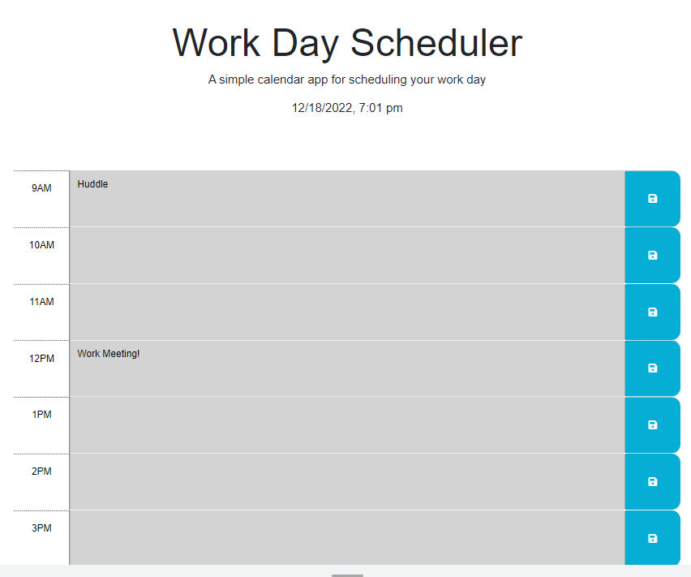

## Daily Planner

## Description

I wanted to create a functional simple calendar application that would allow the user to say events for regular business hours throughout a day. This application is created using HTML, CSS and is powered by jQuery. The calendar takes into account what time of day it is and will change the background color to let you differentiate if your task is in the past, present, or future!

## Installation

No installation is necessary, but you can access this site at https://elizabeth189.github.io/ELLWorkingCalendar/ 

## Usage

The [website](https://elizabeth189.github.io/ELLWorkingCalendar/) created allows you to learn more about Me by clicking on one of the headers located on the R side of the page. 

You can look through the HTML, CSS, and JS files to check out how I created this calendar! 

## License
Please refer to the LICENSE in the repo.

